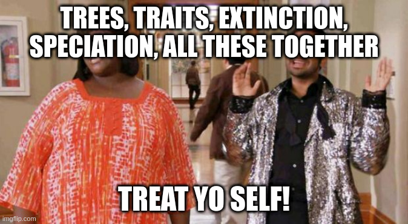

[](https://github.com/TGuillerme/treats/actions)
[](https://codecov.io/gh/TGuillerme/treats)
[](https://www.repostatus.org/#active)
[](https://github.com/TGuillerme/treats/tree/master)
[](https://zenodo.org/badge/latestdoi/299272555)

[](https://cran.r-project.org/)
<a href="https://CRAN.R-project.org/package=treats"></a>
<a href="https://cran.r-project.org/package=treats"></a>

# `treats`: TREes And Traits Simulation

### What is `treats`?

With `treats` you can simulate phylogenetic trees and traits at the same time.
This has can be done with other great packages such as [`FossilSim`](https://cran.r-project.org/package=FossilSim), [`PETER`](https://github.com/PuttickMacroevolution/PETER), [`RPANDA`](https://cran.r-project.org/package=RPANDA), [`TreeSim`](https://cran.r-project.org/package=TreeSim) but `treats` is designed to be super modular so you can simulate trees and traits **the way _you_ want**!
Basically you can simulate a tree depending on the traits of the tip taxa, or not, or something else!
And you can also add events to your simulations that can modify either the tree, the traits or both (or the way they influence each other).
This can be useful for simulating mass extinctions, species competition, traitspace saturation or whatever you can think of.

<!--  -->

<a href="https://besjournals.onlinelibrary.wiley.com/doi/10.1111/2041-210X.14306"></a> 
Check out the [paper](https://besjournals.onlinelibrary.wiley.com/doi/10.1111/2041-210X.14306) associated with the first version of this package.

## Installing `treats`

```r
install.packages("treats")
library(treats)
```

The package is also available in the [phylotastic r-universe](https://phylotastic.r-universe.dev/ui#packages) [](https://phylotastic.r-universe.dev) or through the [phylogenetics](https://cran.r-project.org/web/views/Phylogenetics.html) CRAN Task View. 

## How does it work?

The detailed manual is available [here](http://tguillerme.github.io/treats.html). Alternatively, you can use [this cheat sheet](https://github.com/TGuillerme/treats/blob/master/inst/gitbook/treats_cheat_sheet.pdf) if you're already familiar with the package. 

<a href="https://tguillerme.github.io/treats.html"></a> <a href="https://github.com/TGuillerme/treats/blob/master/inst/gitbook/_book/treats_manual.pdf"></a> 


## Latest patch notes

Patch notes can be seen [here](https://github.com/TGuillerme/treats/blob/master/NEWS.md).

## Workshop

You can get the workshop R markdown document [here](https://github.com/TGuillerme/treats/blob/master/inst/vignettes/treats_workshop.Rmd) or download it directly from [here](https://raw.githubusercontent.com/TGuillerme/treats/master/inst/vignettes/treats_workshop.Rmd) (right click + save as) or visualise it in html from [here](https://cdn.githubraw.com/TGuillerme/treats/master/inst/vignettes/treats_workshop.html). If you have some time you can also watch this [MEE Live!](https://www.youtube.com/watch?v=QUhaFZxER2I) video (55 minutes though!). 

## Simulation templates

If you need some inspiration, you can browse through this gallery of [simulation templates](https://github.com/TGuillerme/treats/issues?q=is%3Aopen+is%3Aissue+label%3A%22simulation+template%22).

If you want to help your fellow or future `treats` users, please share your template as a [simulation template issue](https://github.com/TGuillerme/treats/issues/new?assignees=&labels=simulation+template&projects=&template=simulation-template.md&title=Simulate+something). Don't worry about typos, language or format. The important part is that you're happy to share your template and that it's clear and simple to other users!


Authors and contributors
-------

* [Thomas Guillerme](http://tguillerme.github.io)
